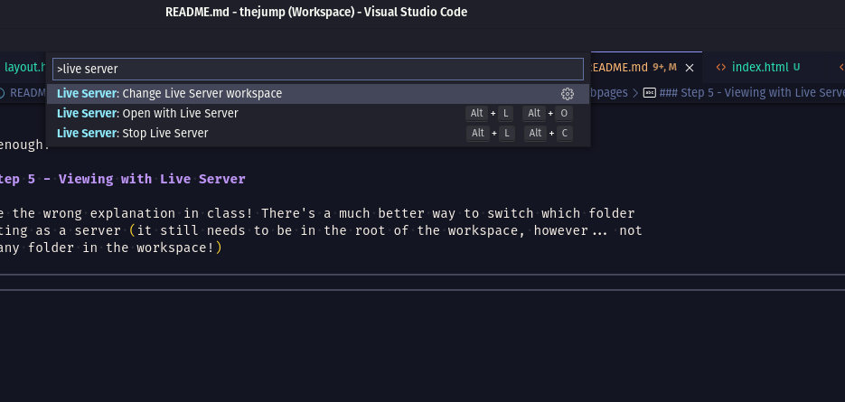

# Viewing with Live Server

I gave the wrong explanation in class! There's a much better way to switch which folder
is acting as a server (it still needs to be in the root of the workspace, however... not
just any folder in the workspace!)

Simply press `ctrl + shift + p` in your vs-code editor and type in the words `change live
server` and you will see the following options:

First select the `Stop Live Server` option, then repeat the above step and select the
`Change Live Server workspace` option and choose from one of the folders in the following
menu using your arrow-keys or your mouse.

When wanting to view a project, be sure the folder is added to the workspace and isn't
just a subdirectory of some other folder that was added. Then follow the steps above to
switch your live server to the desired project you wish to view at `localhost:5500`.
